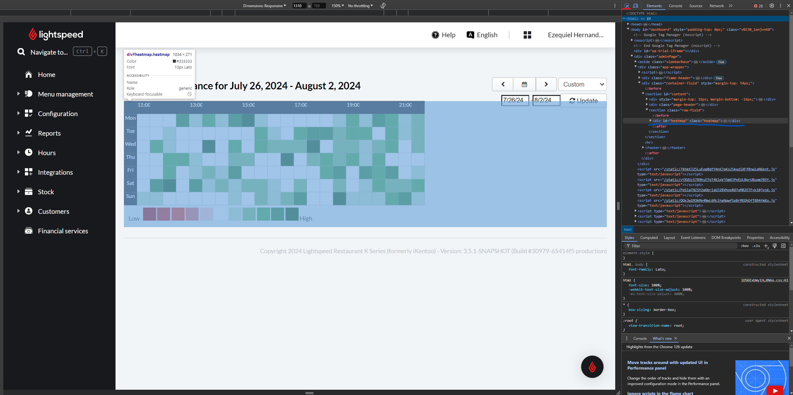

## Table of contents

- [Description](#description)
- [Example](#example)

## Description

- The purpose of this script is to retrieve hourly performance between 2 date ranges in lightspeed's backoffice.
    - If the date range is longer than 1 week then the script will split the date into 1 week increments otherwise the heatmap simply averages the performance.
- Lightspeed currently does not offer a way for their users to download hourly performance as a file.
- The goal was to use selenium and python to scrape our own hourly performance and output a csv file. That way it is much easier for us to analyze trends of sales based on day and hour.

## Example

- Each white and green square shows the sales of the 30 minute block when you hover over the square.

